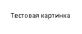

# Основные команды git

**git init** – инициализация локального репозитория

**git status** – получить информацию от git о его текущем состоянии

**git add “path”**– добавить файл или файлы к следующему коммиту

**git add .** - добавляет все файлы в проекте в отслеживание

**git commit -am “message”** - git add + git commit (Работает только после 1-го ручного добавления в отслеживание)

**git commit -m “message”** – создание коммита.

# Оформление текста
**полужирный**

***полужирный курсив***

*курсив*

> блок цитирования

# вставка изображения

## Нумерованный список

1. Основной элемент списка
   1. Вложенный
   1. продолжение вложенного списка
1. продолжение основного списка

